# Frontend Mentor - Multi-step Form

This is a solution to the [multi-step-form on Frontend Mentor](https://www.frontendmentor.io/challenges/multistep-form-YVAnSdqQBJ). Frontend Mentor challenges help you improve your coding skills by building realistic projects.

## Table of contents

- [Overview](#overview)
  - [Screenshot](#screenshot)
  - [Links](#links)
- [My process](#my-process)
  - [Built with](#built-with)
  - [What I learned](#what-i-learned)
  - [Continued development](#continued-development)
- [Author](#author)

## Overview

### Screenshot

Screenshots of the final project.

- Mobile design step 1:

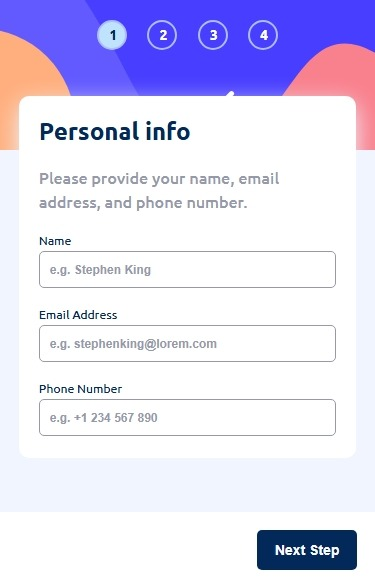

- Mobile design step 2 monthly:

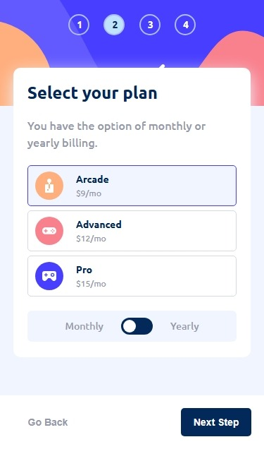

- Mobile design step 2 yearly:

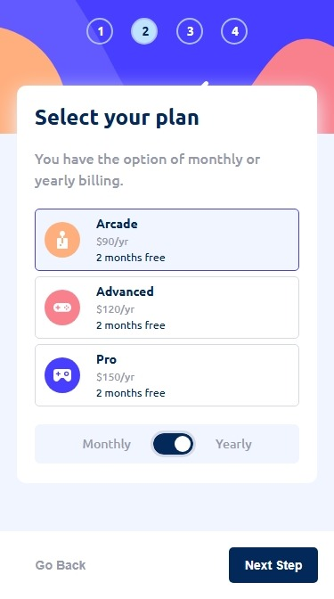

- Mobile design step 3:

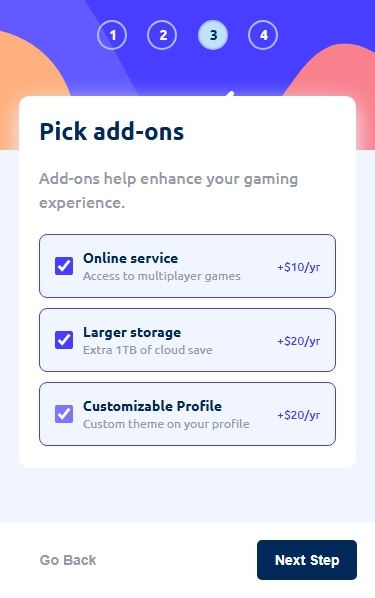

- Mobile design summary:

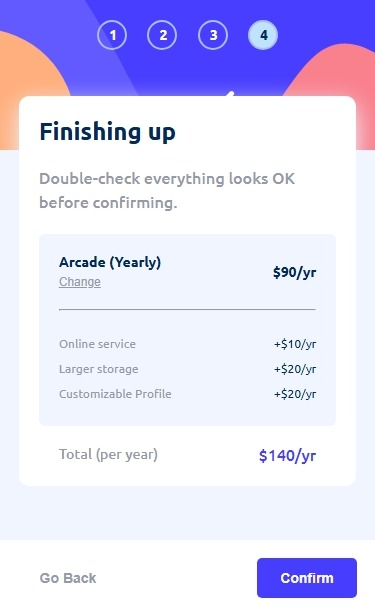

- Mobile design confirmation:


- Desktop design step 1:

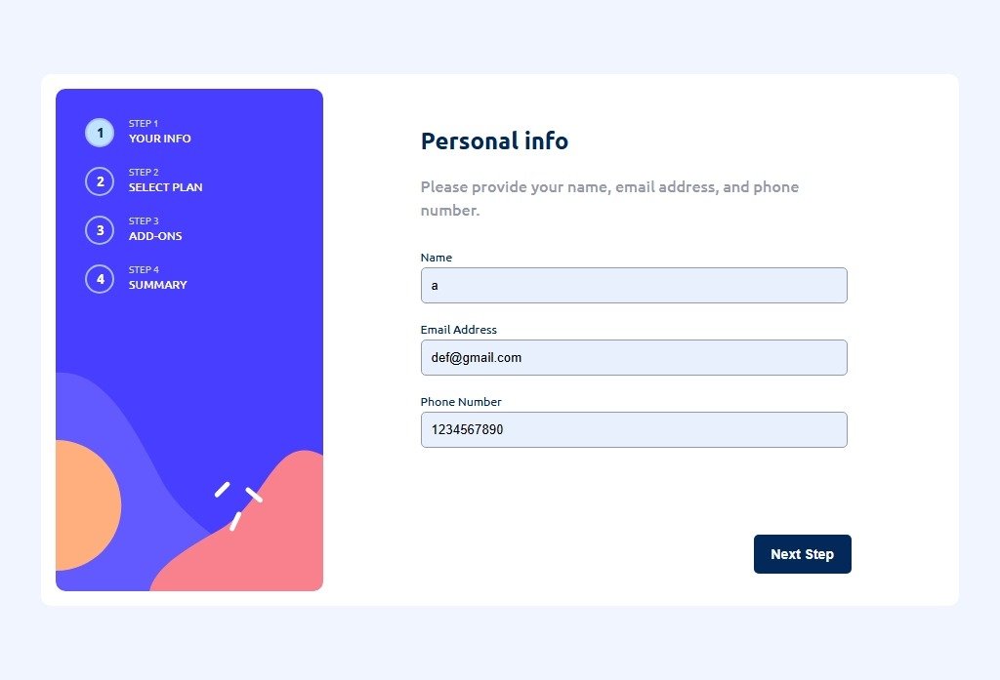

- Desktop design step 2 monthly:

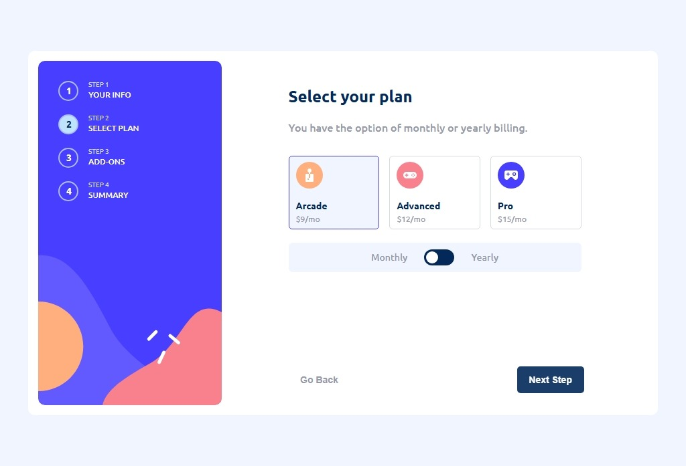

- Desktop design step 2 yearly:

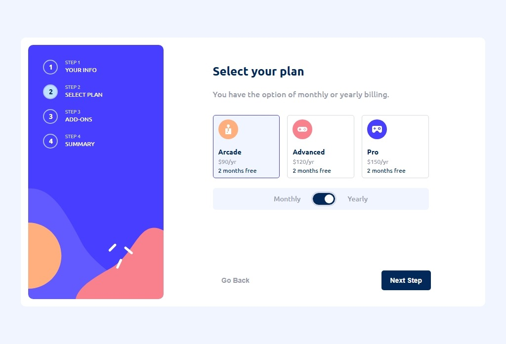

- Desktop design step 3:

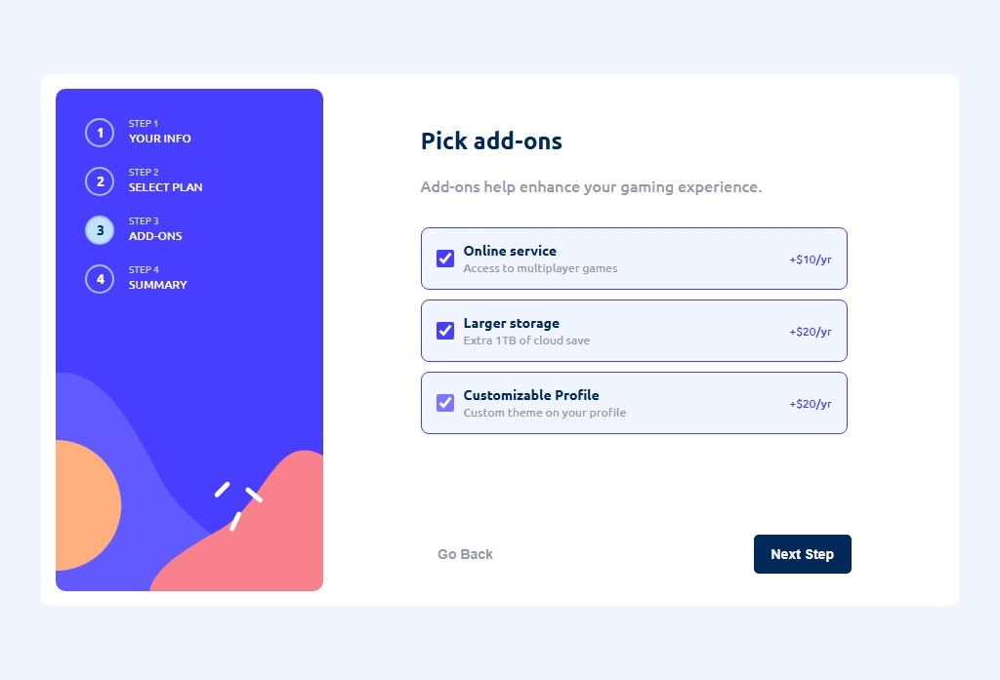

- Desktop design summary:

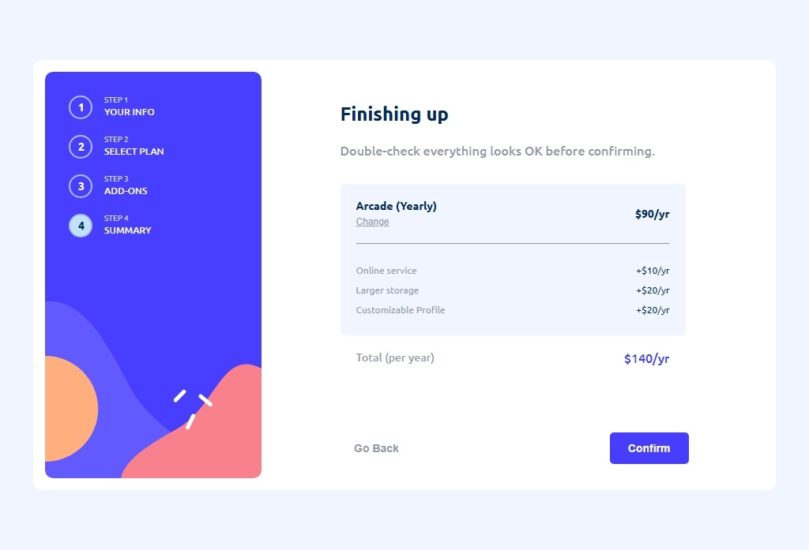

- Desktop design confirmation:

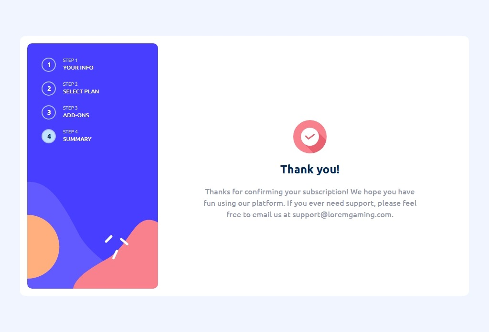

- Active states:

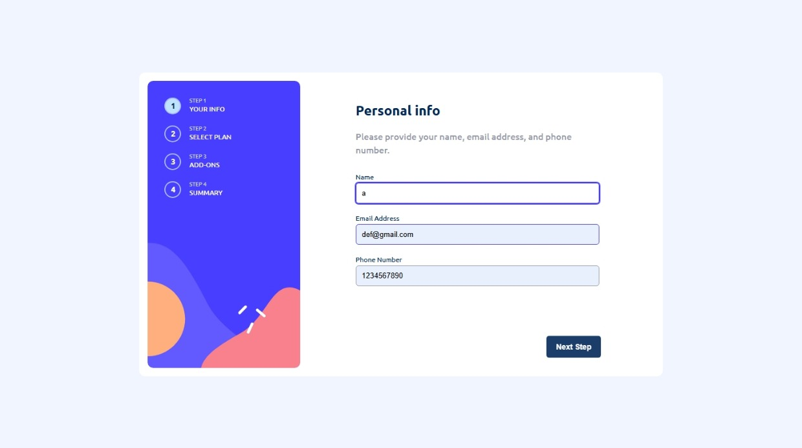
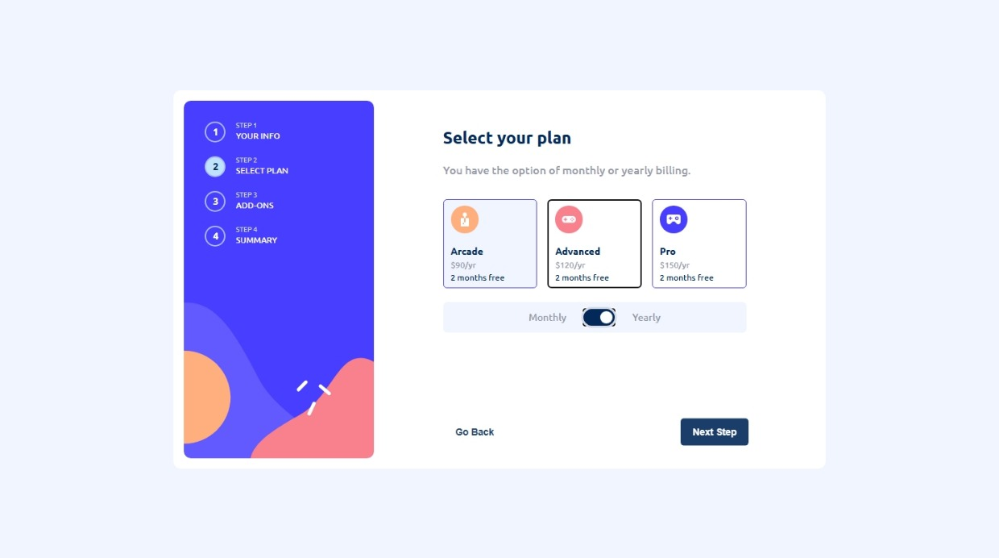
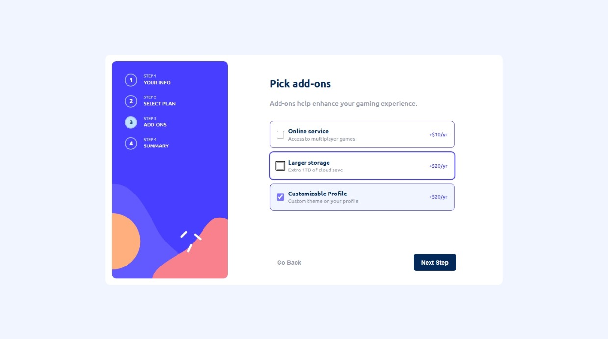
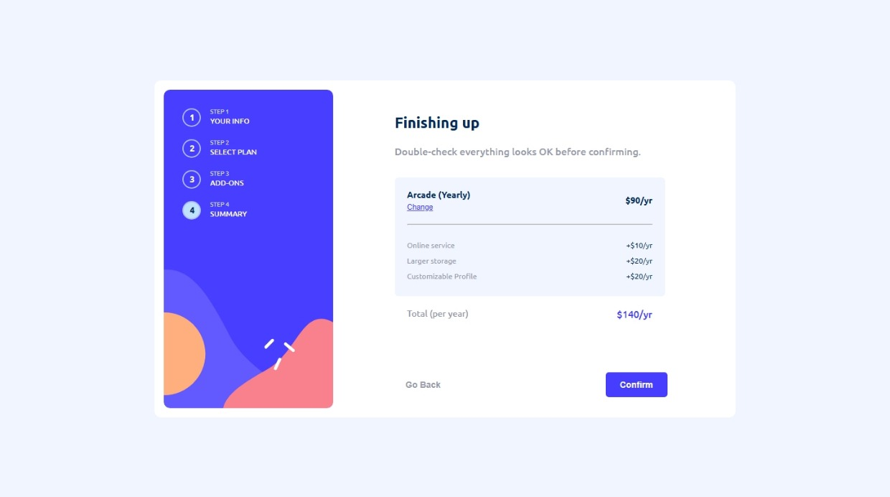

- Error:

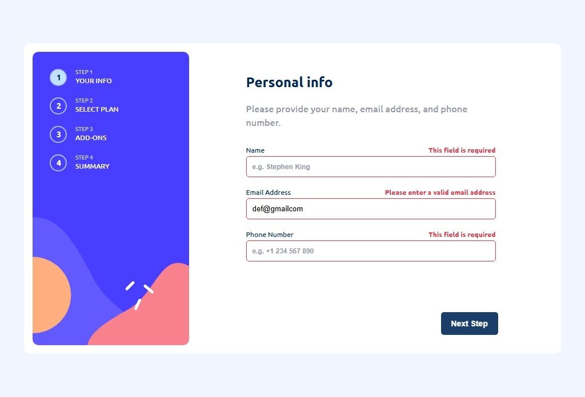

### Links

- Solution URL: [My Solution](https://github.com/gillaercio/multi-step-form-main)
- Live Site URL: [My Solution](https://gillaercio.github.io/multi-step-form-main/)

## My process

### Built with

- Semantic HTML5 markup
- CSS custom properties
- CSS Grid
- Mobile-first workflow
- JavaScript

### What I learned

I used this project to practice:
- "**BEM methodology with HTML**"
- "**CSS Reset**"
- "**CSS Custom Properties (Variables)**"
- "**DOM Manipulation**"
- "**JavaScript Function Modularization**"

BEM (Block Element Modifier)

```html
<main class="multi-step-form">
    <header class="sidebar">
      <nav class="sidebar__nav">
        <ul class="nav-steps">
          <li class="nav-step">
            <span class="step-number active">1</span>
            <div class="step-info">
              <span class="step-label">Step 1</span>
              <span class="step-title">Your info</span>
            </div>
          </li>
<!-- ... -->
```

Reset CSS

```css
*,
:before,
:after {
  margin: 0;
  padding: 0;
  box-sizing: border-box;
}

html {
  font-size: 62.5%;
}
```

Variables

```css
:root {
  --blue-950: hsl(213, 96%, 18%);
  --purple-600: hsl(243, 100%, 62%);
  --blue-300: hsl(228, 100%, 84%);
  --blue-200: hsl(206, 94%, 87%);
  --red-500: hsl(354, 84%, 57%);

  --grey-500: hsl(231, 11%, 63%);
  --purple-200: hsl(229, 24%, 87%);
  --blue-100: hsl(218, 100%, 97%);
  --blue-50: hsl(231, 100%, 99%);
  --white: hsl(0, 100%, 100%);

  --ubuntu: "Ubuntu", sans-serif;

  --txt-xs: 1.2rem;
  --txt-sm: 1.4rem;
  --txt-md: 1.6rem;
  --txt-xl: 2.4rem;

  --fw-medium: 500;
  --fw-bold: 700;

  --line-height-sm: 120%;
  --line-height-md: 150%;
}
```

DOM

```js
//...
function showStep(stepIndex) {
  clearActiveSteps();
  clearActiveNav();

  formSteps[stepIndex].classList.add("active");
  navSteps[stepIndex].classList.add("active");
}
//...
function clearActiveSteps() {
  formSteps.forEach(step => {
    step.classList.remove("active");
  });
}

function clearActiveNav() {
  navSteps.forEach(navStep => {
    navStep.classList.remove("active");
  });
}
//...
```

Modularization

```js
//...
function handleAddonChange() {
  addons.forEach(addon => {
    addon.addEventListener("change", () => {
      if (addon.checked) {
        selectedAddons.push(addon.id);
      } else {
        selectedAddons = selectedAddons.filter(item => item !== addon.id);
      }
    })
  });
}

function handleChangePlan() {
  changeButton.addEventListener("click", () => {
    currentStep = 1;

    showStep(currentStep);

    nextButton.classList.remove("hidden");
    confirmButton.classList.add("hidden");
  });
}
//...
```

### Continued development

I would to continue improving my **HTML**, **CSS** and **JavaScript** skills by building more responsive layouts and writing cleaner, more modular code.

## Author

- Frontend Mentor - [@gillaercio](https://www.frontendmentor.io/profile/gillaercio)
- Github - [My Github](https://github.com/gillaercio)
- LinkedIn - [My LinkedIn](https://www.linkedin.com/in/gildman-la%C3%A9rcio/)